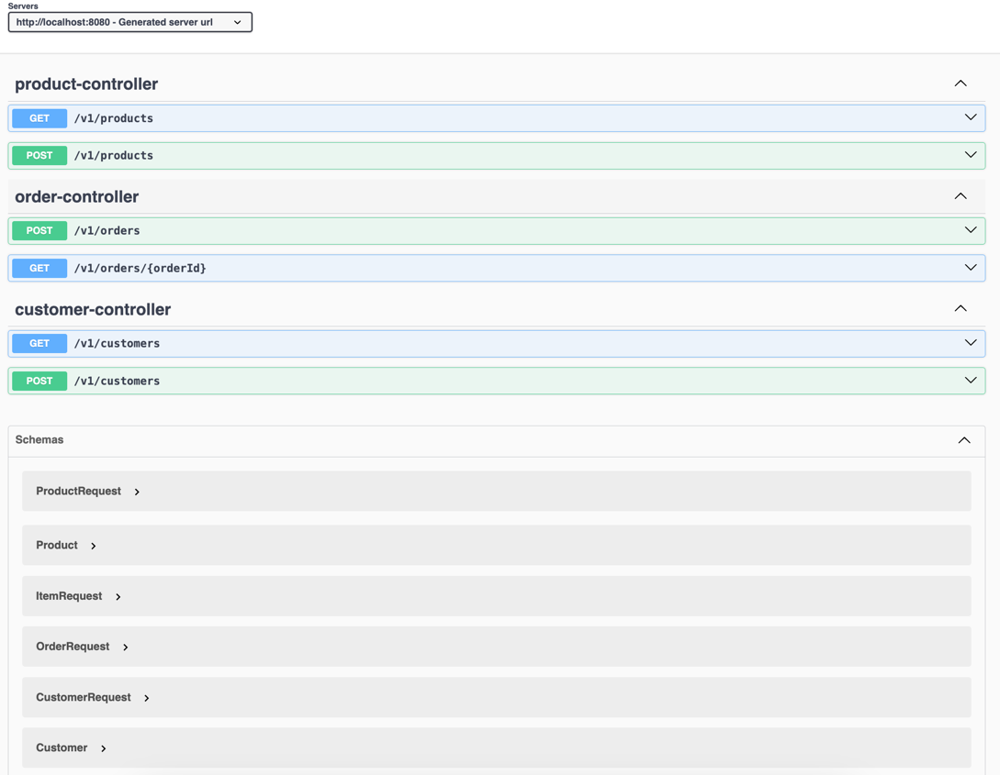
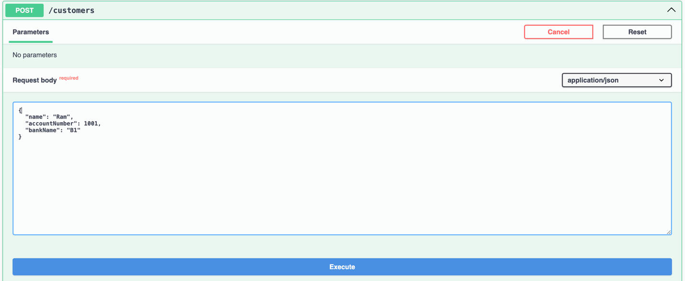

# Order Management System (OMS)

## Overview

The Order Management System (OMS) is a robust platform for handling customer orders, product management, and dynamic pricing using the Strategy Pattern. This system allows for flexible and maintainable discount strategies and integrates with a PostgreSQL database.

## Key Features

- **Order Management**: Create and manage customer orders.
- **Product Management**: Create and retrieve products.
- **Customer Management**: Create and retrieve customers.
- **Dynamic Pricing**: Apply discounts based on various strategies (Seasonal, Volume, Loyalty).

## Why Strategy Pattern?

- **Separation of Concerns**: Each discount strategy is encapsulated in its own class, making the code modular and easy to maintain.
- **Flexibility**: Easy to add new strategies without modifying existing code.
- **Clarity**: The logic for determining if a discount should be applied is clear and separate from the discount calculation logic.

## Why Not Decorator Pattern?

- **Cumulative Discounts**: The Strategy Pattern allows for additive discounts, which is more suitable for our use case.
- **Simplicity**: The Strategy Pattern is straightforward and easier to manage when dealing with multiple discount conditions.

## Setup

### Prerequisites

- Java 17
- Docker
- Docker Compose

### Starting Application
#### Using Docker
1. Build Docker Images
    ```bash
    ./mvnw clean package
    docker build -t oms-app .
    ```
2. Run Docker Compose
    ```bash
    docker-compose up
    ```

3. Access Swagger UI

    http://localhost:8080/swagger-ui/index.html

4. Execute Commands in PostgreSQL

    ```bash
    docker exec -it <container_id> psql -U root -d oms_db
   ```
    
    Replace <container_id> with the actual ID of the running PostgreSQL container. You can find the container ID using:
    `docker ps`

#### Using Java
1. Build the JAR File
    ```bash
    ./mvnw clean package
    ```
2. Create Database

    Ensure you have PostgreSQL running and create a database named oms_db.
    
    Update application.properties with your database connection details:
    ```properties
    spring.datasource.url=jdbc:postgresql://localhost:5432/oms_db
    spring.datasource.username=root
    spring.datasource.password=password
    ```
3. Run the Application
    ```bash
    java -jar target/oms-app.jar
    ```
4. Access Swagger UI
    
    http://localhost:8080/swagger-ui/index.html

### Screenshots
#### Class Diagram


#### Swagger home


#### Creating and listing Products
 


#### Creating and listing Customer



#### Creating and listing Order


#### Test Coverage


#### Order Service

